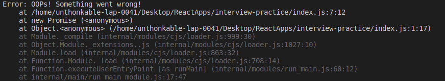

# Promises

### A promise in JavaScript is exactly what it sounds like - you use it to make a promise to do something, usually asynchronously. When the task completes, you either fulfill your promise or fail to do so. Promise is a constructor function, so you need to use the new keyword to create one. It takes a function, as its argument, with two parameters - resolve and reject. These are methods used to determine the outcome of the promise. The syntax looks like this:

```javascript
const myPromise = new Promise((resolve, reject) => {});
```

### Polyfill for promise:

```javascript
function MyPromise(configFuction) {
  let nextSuccessCallback, nextResolve;
  configFuction(function (message) {
    setTimeout(() => {
      if (nextSuccessCallback) {
        result = nextSuccessCallback(message);

        if (result && result.then) {
          result.then(nextResolve);
        } else {
          nextResolve && nextResolve(result);
        }
      }
    });
  });
  return {
    then: (successCallback) => {
      nextSuccessCallback = successCallback;
      return new MyPromise(function (resolve) {
        nextResolve = resolve;
      });
    },
  };
}

new MyPromise((resolve, reject) => {
  resolve("first");
})
  .then((result) => {
    console.log(result);
    return "second";
  })
  .then((result) => console.log(result));

// Output:
// first
// second
```

#### Example - 1

Here's an example that shows how promises can be used in general.

```javascript
const promise = new Promise((resolve, reject) => {
  const success = true;

  if (success) {
    resolve("1u3980938mnbjhb");
  } else {
    reject(new Error(404));
  }
});

promise
  .then((response) => console.log("the secret code is: ", response))
  .catch((error) => console.log("Error: ", error));

// Output:
// the secret code is:  1u3980938mnbjhb
```

Similarly, if value of success is false, then:

```javascript
const promise = new Promise((resolve, reject) => {
  const success = false;

  if (success) {
    resolve("1u3980938mnbjhb");
  } else {
    reject(new Error("OOPs! Something went wrong!"));
  }
});

promise
  .then((response) => console.log("the secret code is: ", response))
  .catch((error) => console.log(error));
```

Output:


#### Example - 2

```javascript
const someWork = () => {
  return new Promise((resolve, reject) => {
    setTimeout(() => resolve("hello JS"), 2000);
  });
};

const getData = async () => {
  const data = await someWork();
  console.group(data);
};

getData();
```

In the above example, the following output pops up after a timeout of 2 minutes(2000ms)

`hello JS`
